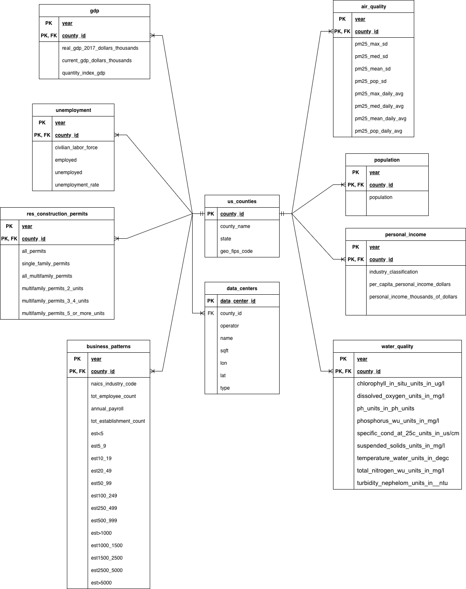
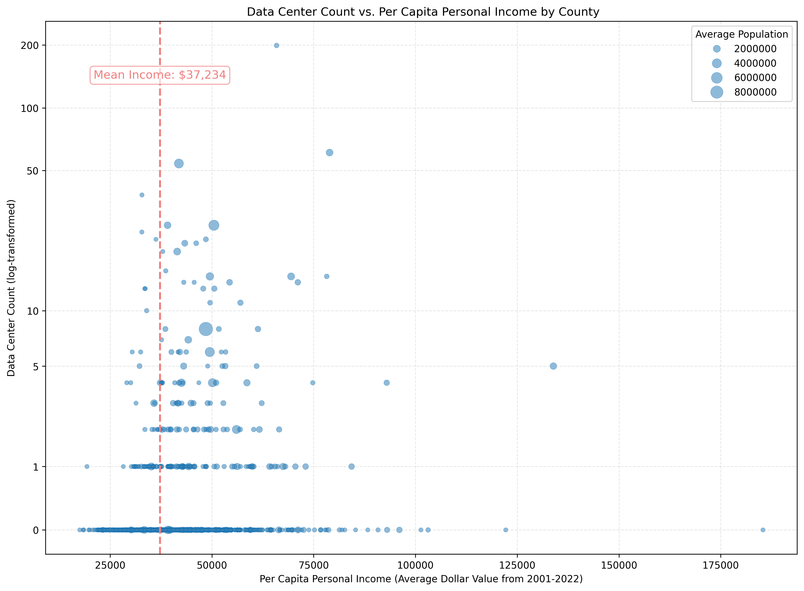
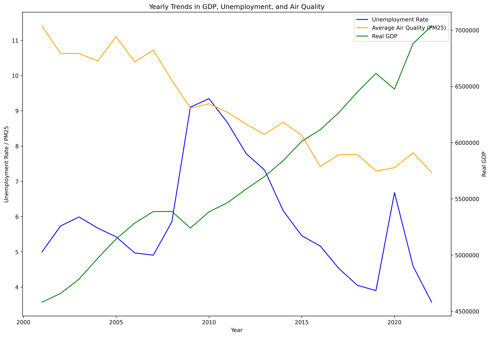

Authors: Logan Rosell & Ian Walsh

## Data Ingestion
Our raw datasets required a number of preprocessing steps before they could be migrated to our database, the following describes a few of the general patterns of problems we encountered. First, the state and county FIPS codes were often separated and automatically dropped critical leading zeros when ingested via `pd.read_csv()`. We resolved this by explicitly importing these columns as strings to preserve the zeros, then concatenating the values to form a unique state-county identifier. Second, because our air and water quality data was at a daily granularity, we aggregated the metrics to an annual average to match our other datasets. To preserve the underlying daily variance of these environmental variables, we supplemented the annual averages by also computing the standard deviation for each measure.

Finally, the County Business Patterns data presented two major obstacles: each year of data came in its own CSV file, and the column names changed multiple times over our analysis period. We overcame the file separation by wrapping our data transformations into modular functions and referencing them within a loop that stepped through each annual file. To handle the changing schemas without crashing our code, we used conditional logic to rename or drop specific columns only if they existed, alongside lookup functions to modify specific measurements based on the values of adjacent columns.

The population, data centers, personal income, GDP, residential construction permits, counties, and unemployment datasets didn't present any manjor obsticles to the cleaning and ingestion process not previously covered. 

## Data Organization

| Table Name | Column Name | Data Type |
| :--- | :--- | :--- |
| **air_quality** | year | int8(64,0) |
| | county_id | text |
| | pm25_max_sd | float8(53) |
| | pm25_med_sd | float8(53) |
| | pm25_mean_sd | float8(53) |
| | pm25_pop_sd | float8(53) |
| | pm25_max_daily_avg | float8(53) |
| | pm25_med_daily_avg | float8(53) |
| | pm25_mean_daily_avg | float8(53) |
| | pm25_pop_daily_avg | float8(53) |
| **business_patterns** | naics_industry_code | text |
| | tot_employee_count | int8(64,0) |
| | annual_payroll | int8(64,0) |
| | tot_establishment_count | int8(64,0) |
| | est<5 | text |
| | est5_9 | text |
| | est10_19 | text |
| | est20_49 | text |
| | est50_99 | text |
| | est100_249 | text |
| | est250_499 | text |
| | est500_999 | text |
| | est>1000 | text |
| | est1000_1500 | text |
| | est1500_2500 | text |
| | est2500_5000 | text |
| | est>5000 | text |
| | year | text |
| | county_id | text |
| **gdp** | year | int8(64,0) |
| | quantity_index_gdp | float8(53) |
| | current_gdp_dollars_thousands | int8(64,0) |
| | real_gdp_2017_dollars_thousands | int8(64,0) |
| | county_id | text |
| **population** | year | int8(64,0) |
| | county_id | text |
| | population | int8(64,0) |
| **data_centers** | data_center_id | text |
| | operator | text |
| | name | text |
| | sqft | float8(53) |
| | lon | float8(53) |
| | lat | float8(53) |
| | type | text |
| | county_id | text |
| **personal_income** | county_id | text |
| | year | int8(64,0) |
| | per_capita_personal_income_dollars | int8(64,0) |
| | personal_income_thousands_of_dollars | int8(64,0) |
| **res_construction_permits**| county_id | text |
| | year | int8(64,0) |
| | all_permits | float8(53) |
| | single_family_permits | float8(53) |
| | all_multifamily_permits | float8(53) |
| | multifamily_permits_2_units | float8(53) |
| | multifamily_permits_3_4_units | float8(53) |
| | multifamily_permits_5_or_more_units| float8(53) |
| **unemployment** | county_id | text |
| | civilian_labor_force | int8(64,0) |
| | employed | int8(64,0) |
| | unemployed | int8(64,0) |
| | unemployment_rate | float8(53) |
| | year | int8(64,0) |
| **us_counties** | state | text |
| | geo_fips_code | text |
| | county_name | text |
| | county_id | text |
*Figure 1.1: Column data types for all database fields.*

## Data Compilation
### Data Centers and Personal Income

The above figure shows a scatter plot of data center count versus per capita personal income from the years 2001 to 2022 by county. Additionally, the size of each dot corresponds to the average county size across those same years. We have also included a vertical line to indicate mean income across all counties, for easy reference. The y-axis is log-transformed here to prevent grouping of points at the very bottom of the graph. 

This graph pulls from 4 different tables:

* Average population from the `county_population` table
* Average per capita personal income from the `personal_income` table
* Count of data centers from the `data_centers` table
* List of all US county codes from the `us_counties` table

### Key Response Variables Over Time

The above figure shows a line plot which plots some of our key response variables over time. For this analysis, we looked at unemployment rate, average air quality, and real GDP. We averaged across all counties in order to look at a more national scale, to identify any significant trends that we may notice in the data later. We can see from this graph that there are significant changes in these variables over time, which we will have to be mindful of during our later analyses.

This graph pulls from 3 different tables:

* Real GDP from the `gdp` table
* Unemployment Rate from the `unemployment` table
* Average Air Quality (PM25) from the `air_quality` table